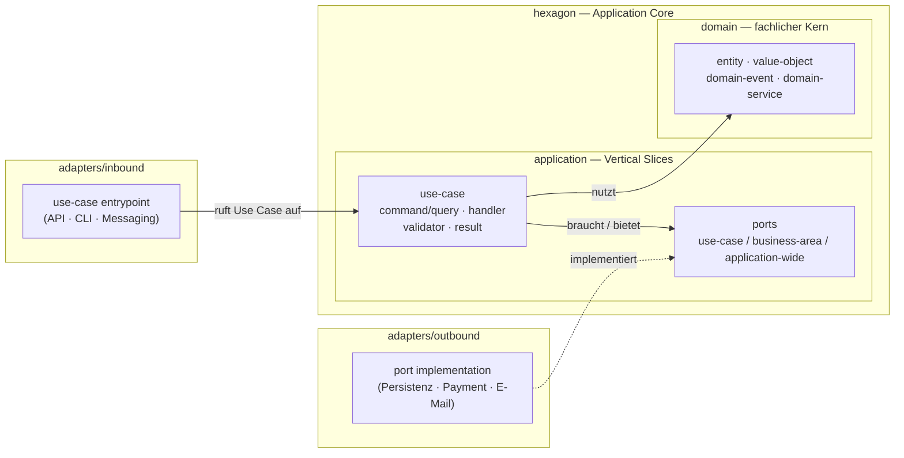

# HexSlice Architecture

[English](hexslice-architecture.md) | **Deutsch**

## Zweck

HexSlice Architecture kombiniert zwei Architekturansätze:

* **Hexagonale Architektur** definiert Systemgrenzen, Ports, Adapter und Abhängigkeitsrichtungen.
* **Vertical Slice Architecture** organisiert den Application Core nach fachlichen Use Cases.

Ziel ist es, den fachlichen Application Core unabhängig von technischer Infrastruktur zu halten und Use Cases leicht verständlich, änderbar und testbar zu machen.

## Grundidee

Use Cases werden als vertikale Slices innerhalb des Application Cores einer hexagonalen Architektur organisiert.

```text
Inbound Adapter
  -> Application Slice
    -> Domain
    -> Port
      <- Outbound Adapter
```

## Architekturbereiche

### Domain

Die Domain enthält das fachliche Modell und die fachlichen Regeln.

Sie sollte unabhängig sein von:

* Frameworks
* Datenbanken
* APIs
* externen Diensten
* infrastrukturellen Belangen

### Application

Die Application-Schicht enthält die Use Cases des Systems.

Jeder Use Case wird als vertikaler Slice modelliert. Ein Slice bündelt alles, was zur Ausführung eines bestimmten Anwendungsverhaltens nötig ist.

Beispiele für Use Cases:

* Bestellung anlegen
* Bestellung stornieren
* Benutzer registrieren
* Rechnung versenden

### Ports

Ports definieren, was der Application Core von der Außenwelt benötigt oder was er ihr anbietet.

Ports gehören dem Application Core, nicht der Infrastruktur.

Ein Port sollte so nah wie möglich bei dem Use Case liegen, der ihn benötigt, und nur dann geteilt werden, wenn mehrere Use Cases tatsächlich denselben Vertrag benötigen.

### Adapter

Adapter verbinden die Außenwelt mit dem Application Core.

Es gibt zwei Haupttypen:

* **Inbound Adapter** stoßen Use Cases an.
* **Outbound Adapter** implementieren die von Use Cases benötigten Ports.

Beispiele:

* API-Controller
* CLI-Kommandos
* Message Consumer
* Datenbank-Persistenz
* Zahlungsanbieter
* E-Mail-Gateways

## Projektstruktur

Ein typisches HexSlice-Projekt bildet die Architektur in der Ordnerstruktur ab:
ein `hexagon` mit dem Application Core, umgeben von `adapters`.

```text
src/
  hexagon/
    domain/
      <business-area>/
        <entity>
        <value-object>
        <domain-event>
        <domain-service>

    application/
      <business-area>/
        <use-case>/
          command | query
          handler
          validator
          result
          ports/
            <use-case-specific-port>

        ports/
          <business-area-shared-port>

      ports/
        <application-wide-port>

  adapters/
    inbound/
      <adapter-type>/
        <business-area>/
          <use-case-entrypoint>

    outbound/
      <adapter-type>/
        <business-area>/
          <port-implementation>
```

Die Abhängigkeitsrichtung zeigt immer nach innen — Adapter hängen vom Core ab,
der Core niemals von Adaptern oder Infrastruktur:



| Ordner | Verantwortung |
| --- | --- |
| `hexagon/domain` | Fachlicher Kern. |
| `hexagon/application` | Use Cases als Vertical Slices. |
| `hexagon/application/.../ports` | Verträge, die die Application braucht oder anbietet. |
| `adapters/inbound` | Ruft Use Cases auf. |
| `adapters/outbound` | Implementiert Ports. |

## Abhängigkeitsregeln

Die Abhängigkeitsrichtung zeigt nach innen.

Erlaubt:

```text
Adapters -> Application
Application -> Domain
Adapters -> Ports
```

Verboten:

```text
Domain -> Application
Domain -> Adapters
Application -> Adapters
Application -> Infrastructure
```

## Regeln

1. Die Domain enthält fachliche Regeln und bleibt technologieunabhängig.
2. Die Application-Schicht enthält die Use Cases.
3. Use Cases werden als Vertical Slices organisiert.
4. Ports werden vom Application Core definiert.
5. Ports leben so lokal wie möglich und so gemeinsam wie nötig.
6. Inbound Adapter rufen Use Cases auf.
7. Outbound Adapter implementieren Ports.
8. Der Core hängt nicht von technischer Infrastruktur ab.

## Zusammenfassung

HexSlice Architecture bedeutet:

> Vertikale Use-Case-Slices innerhalb eines hexagonalen Application Cores, mit Adaptern außen und Ports im Besitz der Application.
