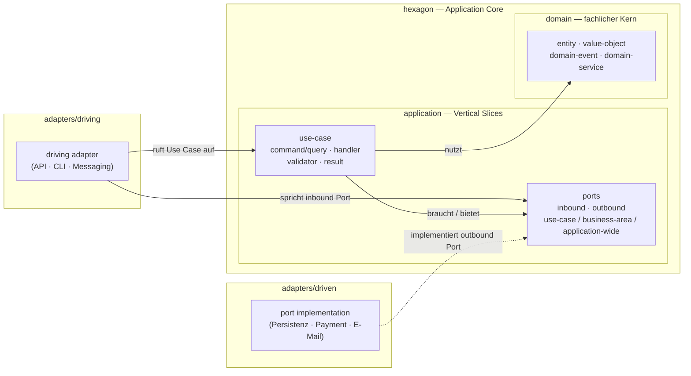

# HexSlice Architecture

[English](hexslice-architecture.md) | **Deutsch**

## Zweck

HexSlice Architecture kombiniert zwei Architekturansätze:

* **Hexagonale Architektur** definiert Systemgrenzen, Ports, Adapter und Abhängigkeitsrichtungen.
* **Vertical Slice Architecture** organisiert den Application Core nach fachlichen Use Cases.

Ziel ist es, den fachlichen Application Core unabhängig von technischer Infrastruktur zu halten und Use Cases leicht verständlich, änderbar und testbar zu machen.

## Grundidee

Use Cases werden als vertikale Slices innerhalb des Application Cores einer hexagonalen Architektur organisiert.

```text
Driving Adapter
  -> inbound Port
    -> Application Slice
      -> Domain
      -> outbound Port
        <- Driven Adapter
```

## Architekturbereiche

### Domain

Die Domain enthält das fachliche Modell und die fachlichen Regeln.

Sie sollte unabhängig sein von:

* Frameworks
* Datenbanken
* APIs
* externen Diensten
* infrastrukturellen Belangen

### Application

Die Application-Schicht enthält die Use Cases des Systems.

Jeder Use Case wird als vertikaler Slice modelliert. Ein Slice bündelt alles, was zur Ausführung eines bestimmten Anwendungsverhaltens nötig ist.

Beispiele für Use Cases:

* Bestellung anlegen
* Bestellung stornieren
* Benutzer registrieren
* Rechnung versenden

### Ports

Ports definieren, was der Application Core von der Außenwelt benötigt oder was er ihr anbietet.

Ports gehören dem Application Core, nicht der Infrastruktur.

Ein Port sollte so nah wie möglich bei dem Use Case liegen, der ihn benötigt, und nur dann geteilt werden, wenn mehrere Use Cases tatsächlich denselben Vertrag benötigen.

Ein Port hat eine **Richtung**, und sein Name nennt sie:

* **Inbound Ports** sind die Verträge, die der Core *anbietet*: die Use-Case-Schnittstellen, die ein Driving Adapter aufruft.
* **Outbound Ports** sind die Verträge, die der Core *benötigt*: implementiert von Driven Adaptern.

Die Richtung beschreibt, wo die Schnittstelle steht — nicht, was etwas mit ihr tut.

### Adapter

Adapter verbinden die Außenwelt mit dem Application Core.

Es gibt zwei Haupttypen, und ihr Name nennt, was sie *tun*:

* **Driving Adapter** rufen Use Cases über deren Inbound Ports auf.
* **Driven Adapter** implementieren die Outbound Ports, die Use Cases benötigen.

Die beiden Vokabulare sind bewusst verschieden: ein Port ist *inbound* oder *outbound* (ein Port treibt nichts — er wird benutzt), ein Adapter ist *driving* oder *driven* (ein Adapter ist nicht „eingehend" — er ruft auf oder wird aufgerufen). Port und Adapter passender Richtung gehören zusammen: `driving` ↔ `inbound`, `driven` ↔ `outbound`.

Beispiele:

* API-Controller
* CLI-Kommandos
* Message Consumer
* Datenbank-Persistenz
* Zahlungsanbieter
* E-Mail-Gateways

## Projektstruktur

Ein typisches HexSlice-Projekt bildet die Architektur in der Ordnerstruktur ab:
ein `hexagon` mit dem Application Core, umgeben von `adapters`.

```text
src/
  hexagon/
    domain/
      <business-area>/
        <entity>
        <value-object>
        <domain-event>
        <domain-service>

    application/
      <business-area>/
        <use-case>/
          command | query
          handler
          validator
          result
          ports/
            inbound/
              <use-case-interface>
            outbound/
              <use-case-specific-port>

        ports/
          inbound/
            <business-area-shared-inbound-port>
          outbound/
            <business-area-shared-port>

      ports/
        inbound/
          <application-wide-inbound-port>
        outbound/
          <application-wide-port>

  adapters/
    driving/
      <adapter-type>/
        <business-area>/
          <use-case-entrypoint>

    driven/
      <adapter-type>/
        <business-area>/
          <port-implementation>
```

Die Typen `command` / `query` und `result` eines Slices sind Ein- und Ausgabe
des Use Case. Veröffentlicht ein Slice einen expliziten Inbound Port, liegen
diese Typen bei diesem Port: der Port besitzt den Vertrag (Interface plus
Request und Result), das Slice implementiert ihn und importiert seinen eigenen
Port — eine Abhängigkeit nach innen, wie jede andere.

Die Abhängigkeitsrichtung zeigt immer nach innen — Adapter hängen vom Core ab,
der Core niemals von Adaptern oder Infrastruktur:


```mermaid
flowchart LR
    subgraph ADIN["adapters/driving"]
        UEP["driving adapter<br/>(API · CLI · Messaging)"]
    end

    subgraph HEX["hexagon — Application Core"]
        direction TB
        subgraph APP["application — Vertical Slices"]
            UC["use-case<br/>command/query · handler<br/>validator · result"]
            PORTS["ports<br/>inbound · outbound<br/>use-case / business-area / application-wide"]
        end
        subgraph DOM["domain — fachlicher Kern"]
            ENT["entity · value-object<br/>domain-event · domain-service"]
        end
    end

    subgraph ADOUT["adapters/driven"]
        IMPL["port implementation<br/>(Persistenz · Payment · E-Mail)"]
    end

    UEP -->|ruft Use Case auf| UC
    UEP -->|spricht inbound Port| PORTS
    UC -->|nutzt| ENT
    UC -->|braucht / bietet| PORTS
    IMPL -.->|implementiert outbound Port| PORTS
```

| Ordner | Verantwortung |
| --- | --- |
| `hexagon/domain` | Fachlicher Kern. |
| `hexagon/application` | Use Cases als Vertical Slices. |
| `hexagon/application/.../ports/inbound` | Verträge, die die Application anbietet. |
| `hexagon/application/.../ports/outbound` | Verträge, die die Application benötigt. |
| `adapters/driving` | Ruft Use Cases über Inbound Ports auf. |
| `adapters/driven` | Implementiert Outbound Ports. |

## Abhängigkeitsregeln

Die Abhängigkeitsrichtung zeigt nach innen.

Erlaubt:

```text
Adapters -> Application
Application -> Domain
Adapters -> Ports
```

Verboten:

```text
Domain -> Application
Domain -> Adapters
Application -> Adapters
Application -> Infrastructure
```

## Regeln

1. Die Domain enthält fachliche Regeln und bleibt technologieunabhängig.
2. Die Application-Schicht enthält die Use Cases.
3. Use Cases werden als Vertical Slices organisiert.
4. Ports werden vom Application Core definiert.
5. Ports leben so lokal wie möglich und so gemeinsam wie nötig.
6. Ports tragen eine Richtung: Inbound Ports bietet der Core an, Outbound Ports benötigt er.
7. Driving Adapter rufen Use Cases über deren Inbound Ports auf.
8. Driven Adapter implementieren Outbound Ports.
9. Der Core hängt nicht von technischer Infrastruktur ab.

## Zusammenfassung

HexSlice Architecture bedeutet:

> Vertikale Use-Case-Slices innerhalb eines hexagonalen Application Cores, mit Adaptern außen und Ports im Besitz der Application.
