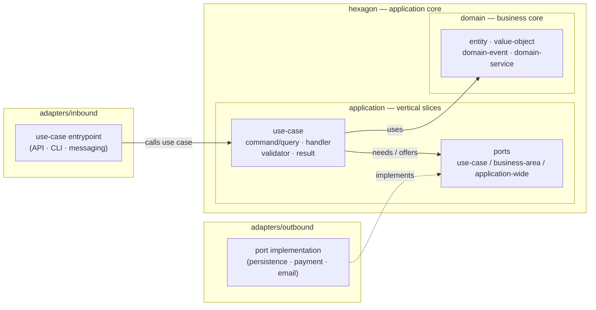

# HexSlice Architecture

**English** | [Deutsch](hexslice-architecture.de.md)

## Purpose

HexSlice Architecture combines two architectural ideas:

* **Hexagonal Architecture** defines the system boundaries, ports, adapters, and dependency direction.
* **Vertical Slice Architecture** organizes the application core by use cases.

The goal is to keep the business and application core independent from technical infrastructure while making use cases easy to understand, change, and test.

## Core Idea

Use cases are organized as vertical slices inside the application core of a hexagonal architecture.

```text
Inbound Adapter
  -> Application Slice
    -> Domain
    -> Port
      <- Outbound Adapter
```

## Architectural Areas

### Domain

The domain contains the business model and business rules.

It should be independent from:

* frameworks
* databases
* APIs
* external services
* infrastructure concerns

### Application

The application layer contains the use cases of the system.

Each use case is modeled as a vertical slice. A slice groups everything needed to execute one specific application behavior.

Examples of use cases:

* Create order
* Cancel order
* Register user
* Send invoice

### Ports

Ports define what the application core needs from the outside world or what it offers to the outside world.

Ports are owned by the application core, not by infrastructure.

A port should live as close as possible to the use case that needs it and only be shared when multiple use cases truly require the same contract.

### Adapters

Adapters connect the outside world to the application core.

There are two main types:

* **Inbound adapters** trigger use cases.
* **Outbound adapters** implement ports required by use cases.

Examples:

* API controllers
* CLI commands
* message consumers
* database persistence
* payment providers
* email gateways

## Project Structure

A typical HexSlice project mirrors the architecture in its folder layout: a
`hexagon` holding the application core, surrounded by `adapters`.

```text
src/
  hexagon/
    domain/
      <business-area>/
        <entity>
        <value-object>
        <domain-event>
        <domain-service>

    application/
      <business-area>/
        <use-case>/
          command | query
          handler
          validator
          result
          ports/
            <use-case-specific-port>

        ports/
          <business-area-shared-port>

      ports/
        <application-wide-port>

  adapters/
    inbound/
      <adapter-type>/
        <business-area>/
          <use-case-entrypoint>

    outbound/
      <adapter-type>/
        <business-area>/
          <port-implementation>
```

The dependency direction always points inward — adapters depend on the core,
the core never depends on adapters or infrastructure:



| Folder | Responsibility |
| --- | --- |
| `hexagon/domain` | The business core. |
| `hexagon/application` | Use cases as vertical slices. |
| `hexagon/application/.../ports` | Contracts the application needs or offers. |
| `adapters/inbound` | Calls use cases. |
| `adapters/outbound` | Implements ports. |

## Dependency Rules

The dependency direction points inward.

Allowed:

```text
Adapters -> Application
Application -> Domain
Adapters -> Ports
```

Forbidden:

```text
Domain -> Application
Domain -> Adapters
Application -> Adapters
Application -> Infrastructure
```

## Rules

1. The domain contains business rules and remains technology-independent.
2. The application layer contains use cases.
3. Use cases are organized as vertical slices.
4. Ports are defined by the application core.
5. Ports live as locally as possible and as shared as necessary.
6. Inbound adapters call use cases.
7. Outbound adapters implement ports.
8. The core does not depend on technical infrastructure.

## Summary

HexSlice Architecture means:

> Vertical use-case slices inside a hexagonal application core, with adapters outside and ports owned by the application.

