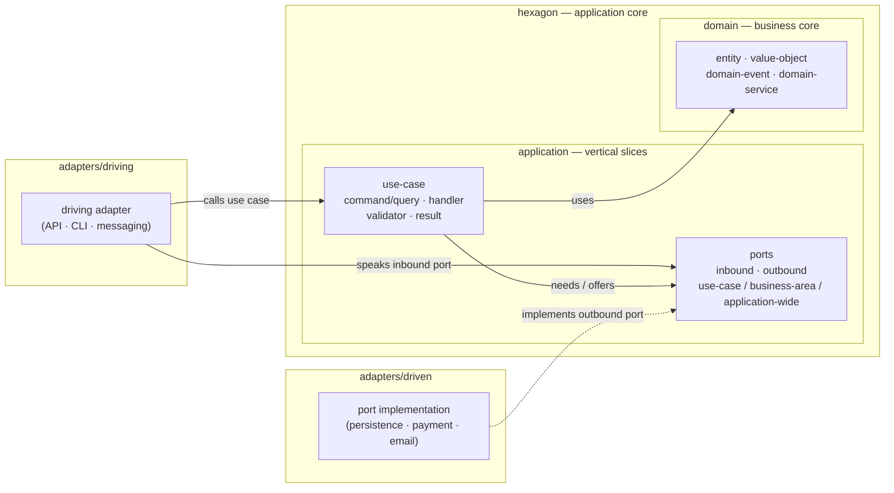

# HexSlice Architecture

**English** | [Deutsch](hexslice-architecture.de.md)

## Purpose

HexSlice Architecture combines two architectural ideas:

* **Hexagonal Architecture** defines the system boundaries, ports, adapters, and dependency direction.
* **Vertical Slice Architecture** organizes the application core by use cases.

The goal is to keep the business and application core independent from technical infrastructure while making use cases easy to understand, change, and test.

## Core Idea

Use cases are organized as vertical slices inside the application core of a hexagonal architecture.

```text
Driving Adapter
  -> inbound Port
    -> Application Slice
      -> Domain
      -> outbound Port
        <- Driven Adapter
```

## Architectural Areas

### Domain

The domain contains the business model and business rules.

It should be independent from:

* frameworks
* databases
* APIs
* external services
* infrastructure concerns

### Application

The application layer contains the use cases of the system.

Each use case is modeled as a vertical slice. A slice groups everything needed to execute one specific application behavior.

Examples of use cases:

* Create order
* Cancel order
* Register user
* Send invoice

### Ports

Ports define what the application core needs from the outside world or what it offers to the outside world.

Ports are owned by the application core, not by infrastructure.

A port should live as close as possible to the use case that needs it and only be shared when multiple use cases truly require the same contract.

A port has a **direction**, and its name states it:

* **Inbound ports** are the contracts the core *offers*: the use-case interfaces a driving adapter calls.
* **Outbound ports** are the contracts the core *needs*: implemented by driven adapters.

The direction is what the port *is* — it describes where the interface stands, not what something does with it.

### Adapters

Adapters connect the outside world to the application core.

There are two main types, and their name states what they *do*:

* **Driving adapters** call use cases through their inbound ports.
* **Driven adapters** implement the outbound ports required by use cases.

The two vocabularies are deliberately different: a port is *inbound* or *outbound* (a port drives nothing — it is used), an adapter is *driving* or *driven* (an adapter is not "inbound" — it either calls or is called). A port and an adapter of matching direction belong together: `driving` ↔ `inbound`, `driven` ↔ `outbound`.

Examples:

* API controllers
* CLI commands
* message consumers
* database persistence
* payment providers
* email gateways

## Project Structure

A typical HexSlice project mirrors the architecture in its folder layout: a
`hexagon` holding the application core, surrounded by `adapters`.

```text
src/
  hexagon/
    domain/
      <business-area>/
        <entity>
        <value-object>
        <domain-event>
        <domain-service>

    application/
      <business-area>/
        <use-case>/
          command | query
          handler
          validator
          result
          ports/
            inbound/
              <use-case-interface>
            outbound/
              <use-case-specific-port>

        ports/
          inbound/
            <business-area-shared-inbound-port>
          outbound/
            <business-area-shared-port>

      ports/
        inbound/
          <application-wide-inbound-port>
        outbound/
          <application-wide-port>

  adapters/
    driving/
      <adapter-type>/
        <business-area>/
          <use-case-entrypoint>

    driven/
      <adapter-type>/
        <business-area>/
          <port-implementation>
```

The slice's `command` / `query` and `result` types are the use case's input and
output. When a slice publishes an explicit inbound port, those types live with
that port: the port owns the contract (interface plus request and result), the
slice implements it and imports its own port — an inward dependency, like every
other one.

The dependency direction always points inward — adapters depend on the core,
the core never depends on adapters or infrastructure:


```mermaid
flowchart LR
    subgraph ADIN["adapters/driving"]
        UEP["driving adapter<br/>(API · CLI · messaging)"]
    end

    subgraph HEX["hexagon — application core"]
        direction TB
        subgraph APP["application — vertical slices"]
            UC["use-case<br/>command/query · handler<br/>validator · result"]
            PORTS["ports<br/>inbound · outbound<br/>use-case / business-area / application-wide"]
        end
        subgraph DOM["domain — business core"]
            ENT["entity · value-object<br/>domain-event · domain-service"]
        end
    end

    subgraph ADOUT["adapters/driven"]
        IMPL["port implementation<br/>(persistence · payment · email)"]
    end

    UEP -->|calls use case| UC
    UEP -->|speaks inbound port| PORTS
    UC -->|uses| ENT
    UC -->|needs / offers| PORTS
    IMPL -.->|implements outbound port| PORTS
```

| Folder | Responsibility |
| --- | --- |
| `hexagon/domain` | The business core. |
| `hexagon/application` | Use cases as vertical slices. |
| `hexagon/application/.../ports/inbound` | Contracts the application offers. |
| `hexagon/application/.../ports/outbound` | Contracts the application needs. |
| `adapters/driving` | Calls use cases through inbound ports. |
| `adapters/driven` | Implements outbound ports. |

## Dependency Rules

The dependency direction points inward.

Allowed:

```text
Adapters -> Application
Application -> Domain
Adapters -> Ports
```

Forbidden:

```text
Domain -> Application
Domain -> Adapters
Application -> Adapters
Application -> Infrastructure
```

## Rules

1. The domain contains business rules and remains technology-independent.
2. The application layer contains use cases.
3. Use cases are organized as vertical slices.
4. Ports are defined by the application core.
5. Ports live as locally as possible and as shared as necessary.
6. Ports carry a direction: inbound ports are offered by the core, outbound ports are needed by it.
7. Driving adapters call use cases through their inbound ports.
8. Driven adapters implement outbound ports.
9. The core does not depend on technical infrastructure.

## Summary

HexSlice Architecture means:

> Vertical use-case slices inside a hexagonal application core, with adapters outside and ports owned by the application.
